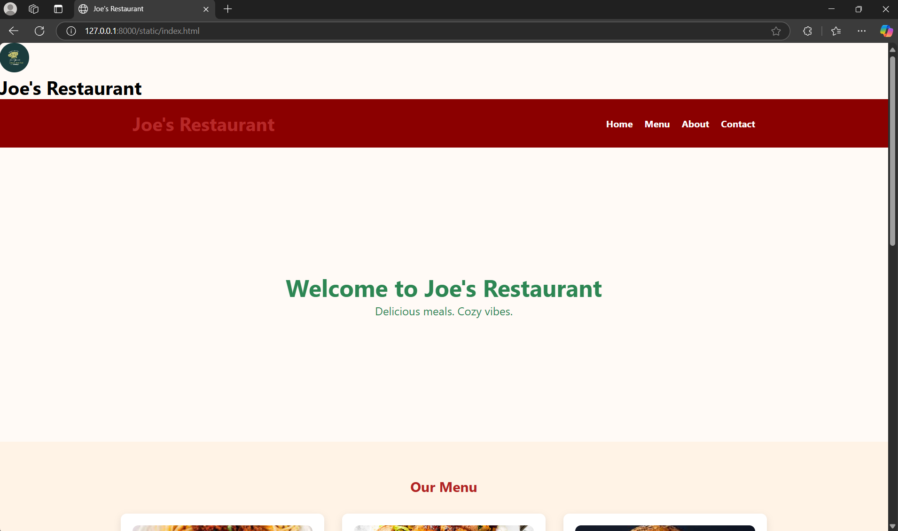
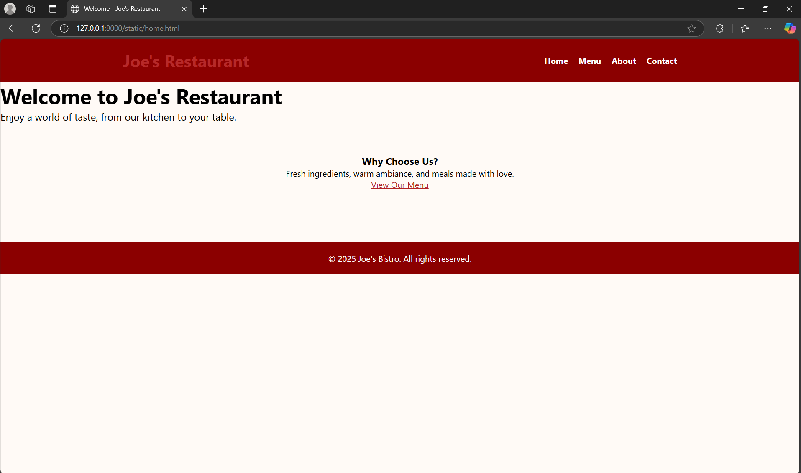
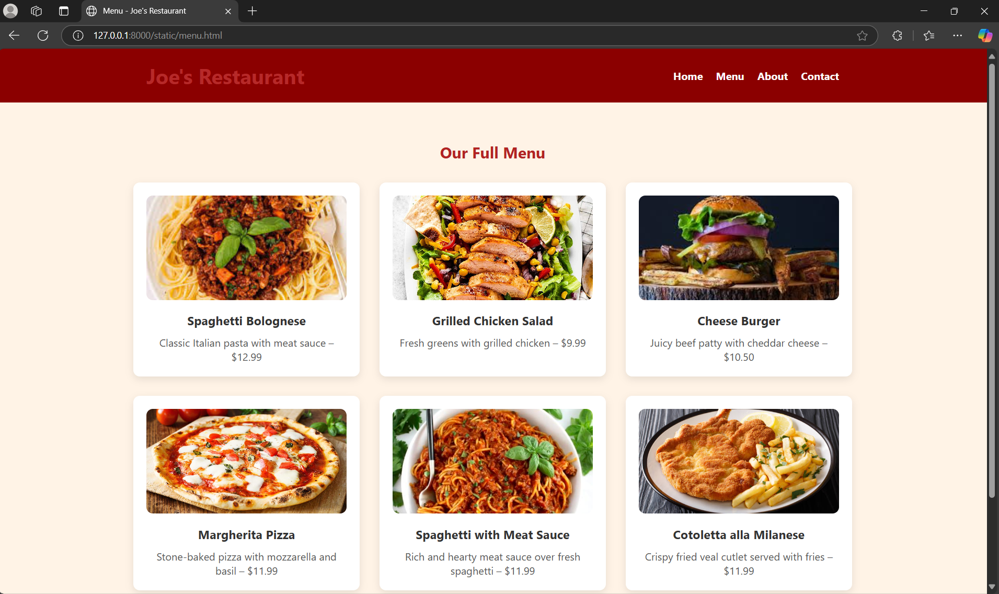

# Ex.07 Restaurant Website
## Date:02/05/2025

## AIM:
To develop a static Restaurant website to display the food items and services provided by them.

## DESIGN STEPS:

### Step 1:
Requirement collection.

### Step 2:
Creating the layout using HTML and CSS.

### Step 3:
Updating the sample content.

### Step 4:
Choose the appropriate style and color scheme.

### Step 5:
Validate the layout in various browsers.

### Step 6:
Validate the HTML code.

### Step 7:
Publish the website in the given URL.

## PROGRAM:
### index.html
```
<!DOCTYPE html>
<html lang="en">
<head>
  <meta charset="UTF-8" />
  <meta name="viewport" content="width=device-width, initial-scale=1.0"/>
  <title>Joe's Restaurant</title>
  <link rel="stylesheet" href="style.css"/>
</head>
<div class="Joe’sRestaurent">
    
    <h1>Joe's Restaurant</h1>
  </div>
  
<body>

  <header>
    <div class="container">
      <h1>Joe's Restaurant</h1>
      <nav>
        <ul>
          <li><a href="home.html">Home</a></li>
          <li><a href="menu.html">Menu</a></li>
          <li><a href="about.html">About</a></li>
          <li><a href="index.html#contact">Contact</a></li>
        </ul>
      </nav>
    </div>
  </header>

  <section id="hero">
    <div class="hero-content">
      <h2>Welcome to Joe's Restaurant</h2>
      <p>Delicious meals. Cozy vibes.</p>
    </div>
  </section>

  <section id="menu">
    <h2>Our Menu</h2>
    <div class="menu-grid">
      <div class="menu-card">
        
        <h3>Spaghetti Bolognese</h3>
        <p>Classic Italian pasta with meat sauce – $12.99</p>
      </div>
      <div class="menu-card">
        
        <h3>Grilled Chicken Salad</h3>
        <p>Fresh greens with grilled chicken – $9.99</p>
      </div>
      <div class="menu-card">
        
        <h3>Cheese Burger</h3>
        <p>Juicy beef patty with cheddar cheese – $10.50</p>
      </div>
      <div class="menu-card">
        
        <h3>Margherita Pizza</h3>
        <p>Stone-baked pizza with mozzarella and basil – $11.99</p>
      </div>
      <div class="menu-card">
        
        <h3>Spaghetti with Meat Sauce</h3>
        <p>Rich, robust flavors from ground beef – $11.99</p>
      </div>
      <div class="menu-card">
        
        <h3>Cotoletta alla Milanese</h3>
        <p>Crunchy breadcrumbed veal cutlet – $11.99</p>
      </div>
    </div>
  </section>

  <section id="about">
    <h2>About Us</h2>
    <p>At Joe's Bistro, we're passionate about food and friendly service. We use fresh, local ingredients to prepare delicious meals in a cozy, welcoming atmosphere.</p>
  </section>

  <section id="contact">
    <h2>Contact</h2>
    <p>📞 Phone: +91 9042171157</p>
    <p>📍 Address: karumavilai,karungal,k.k district</p>
    <p>📧 Email: astlejoe789@gmail.com</p>
  </section>

  <footer>
    <p>&copy; 2025 Joe's Restaurant. All rights reserved.</p>
  </footer>

</body>
</html>
```
### home.html:
```
<!DOCTYPE html>
<html lang="en">
<head>
  <meta charset="UTF-8" />
  <meta name="viewport" content="width=device-width, initial-scale=1.0"/>
  <title>Welcome - Joe's Restaurant</title>
  <link rel="stylesheet" href="style.css"/>
</head>
<body>

  <header>
    <div class="container">
      <h1>Joe's Restaurant</h1>
      <nav>
        <ul>
          <li><a href="home.html">Home</a></li>
          <li><a href="index.html#menu">Menu</a></li>
          <li><a href="index.html#about">About</a></li>
          <li><a href="index.html#contact">Contact</a></li>
        </ul>
      </nav>
    </div>
  </header>

  <section id="welcome">
    <div class="hero-content">
      <h2>Welcome to Joe's Restaurant</h2>
      <p>Enjoy a world of taste, from our kitchen to your table.</p>
    </div>
  </section>

  <section style="text-align: center; padding: 60px;">
    <h3>Why Choose Us?</h3>
    <p>Fresh ingredients, warm ambiance, and meals made with love.</p>
    <p><a href="index.html#menu" style="color: #b22222; text-decoration: underline;">View Our Menu</a></p>
  </section>

  <footer>
    <p>&copy; 2025 Joe's Bistro. All rights reserved.</p>
  </footer>

</body>
</html>

```
### menu.html:
```
<!DOCTYPE html>
<html lang="en">
<head>
  <meta charset="UTF-8" />
  <meta name="viewport" content="width=device-width, initial-scale=1.0"/>
  <title>Menu - Joe's Restaurant</title>
  <link rel="stylesheet" href="style.css"/>
</head>
<body>

  <header>
    <div class="container">
      <h1>Joe's Restaurant</h1>
      <nav>
        <ul>
          <li><a href="home.html">Home</a></li>
          <li><a href="menu.html">Menu</a></li>
          <li><a href="about.html">About</a></li>
          <li><a href="index.html#contact">Contact</a></li>
        </ul>
      </nav>
    </div>
  </header>

  <section id="menu">
    <h2 style="text-align:center;">Our Full Menu</h2>
    <div class="menu-grid">
      <div class="menu-card">
        
        <h3>Spaghetti Bolognese</h3>
        <p>Classic Italian pasta with meat sauce – $12.99</p>
      </div>
      <div class="menu-card">
        
        <h3>Grilled Chicken Salad</h3>
        <p>Fresh greens with grilled chicken – $9.99</p>
      </div>
      <div class="menu-card">
        
        <h3>Cheese Burger</h3>
        <p>Juicy beef patty with cheddar cheese – $10.50</p>
      </div>
      <div class="menu-card">
        
        <h3>Margherita Pizza</h3>
        <p>Stone-baked pizza with mozzarella and basil – $11.99</p>
      </div>
      <div class="menu-card">
        
        <h3>Spaghetti with Meat Sauce</h3>
        <p>Rich and hearty meat sauce over fresh spaghetti – $11.99</p>
      </div>
      <div class="menu-card">
        
        <h3>Cotoletta alla Milanese</h3>
        <p>Crispy fried veal cutlet served with fries – $11.99</p>
      </div>
    </div>
  </section>

  <footer>
    <p>&copy; 2025 Joe's Bistro. All rights reserved.</p>
  </footer>

</body>
</html>

```
### about.html:
```
<!DOCTYPE html>
<html lang="en">
<head>
  <meta charset="UTF-8" />
  <meta name="viewport" content="width=device-width, initial-scale=1.0"/>
  <title>About - Joe's Restaurant</title>
  <link rel="stylesheet" href="style.css"/>
</head>
<body>

  <header>
    <div class="container">
      <h1>Joe's Restaurant</h1>
      <nav>
        <ul>
          <li><a href="home.html">Home</a></li>
          <li><a href="index.html#menu">Menu</a></li>
          <li><a href="about.html">About</a></li>
          <li><a href="index.html#contact">Contact</a></li>
        </ul>
      </nav>
    </div>
  </header>

  <section id="about" style="padding: 40px; text-align: center;">
    <h2>About Us</h2>
    <p style="max-width: 800px; margin: auto;">
      At Joe's Restaurant, we believe food is not just nourishment but an experience. 
      Since opening our doors in 2010, we've been serving mouthwatering dishes made with 
      fresh, local ingredients. Our chefs combine traditional recipes with modern techniques 
      to give you a culinary experience to remember. Whether you're here for a casual lunch 
      or a special celebration, Joe’s is the perfect spot.
    </p>
  </section>

  <section id="location" style="text-align: center; padding: 40px;">
    <h2>Find Us</h2>
    <p>📍 karumavilai,karungal,K.K district</p>
    <div style="margin-top: 20px;">
      <iframe
        src="https://www.google.com/maps?q=123+Main+Street,+Food+City&output=embed"
        width="80%" height="400" style="border:0;" allowfullscreen="" loading="lazy">
      </iframe>
    </div>
  </section>

  <footer>
    <p>&copy; 2025 Joe's Bistro. All rights reserved.</p>
  </footer>

</body>
</html>

```

## OUTPUT:
index.html:



home.html:



menu.html:


about.html:


## RESULT:
The program for designing software company website using HTML and CSS is completed successfully.
